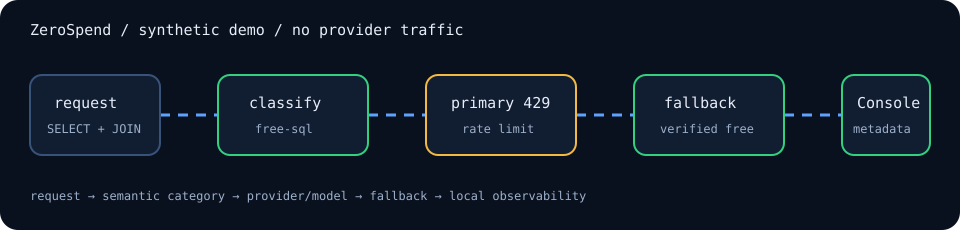
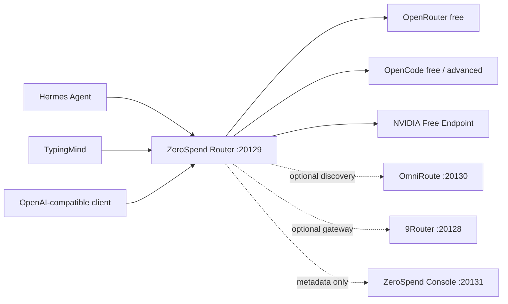

# ZeroSpend

**One local OpenAI-compatible endpoint that discovers, verifies, benchmarks, and routes to the best currently free model for each task.**

[](https://github.com/sjfakharian/zerospend/actions/workflows/ci.yml) [](LICENSE) [](package.json) [](docs/installation/macos.md) [](https://github.com/sjfakharian/zerospend/releases)

[](docs/dashboard.md)

ZeroSpend combines deterministic task routing, current zero-cost evidence, bounded model evaluation, runtime reliability feedback, provider fallback, and a metadata-only local console. It supports Hermes Agent, TypingMind, and generic OpenAI-compatible clients without logging prompts.

## Why ZeroSpend?

- **Verified zero-cost only:** unknown cost is rejected; paid fallback is impossible by policy.
- **Task-aware:** code, SQL, reasoning, general, tools, fast, long-context, and structured-output routes.
- **Current evidence:** daily discovery removes stale or ambiguous routes while preserving the last known-good configuration on failure.
- **Measured quality:** quota-efficient weekly synthetic benchmarks with anti-churn promotion thresholds.
- **Runtime-aware:** latency, availability, rate limits, fallbacks, and tool reliability influence ordering.
- **Local observability:** request metadata only—no prompts, completions, SQL, tool arguments, or telemetry.

## 30-second architecture



All services bind to `127.0.0.1` by default.

## Quick start

```bash
git clone https://github.com/sjfakharian/zerospend.git
cd zerospend
./install.sh
zerospend setup
zerospend doctor
npm run console
```

Open `http://127.0.0.1:20131`, add one provider in Providers, test it, and run discovery. 9Router, OmniRoute, and OpenCode are not required for first success.

Terminal-first users can run `zerospend provider add`, followed by `zerospend provider test openrouter` and `zerospend providers`. API keys are collected through hidden terminal input, never command arguments.

Run `zerospend components` for a credential-free inventory of Router, Console, Hermes, 9Router, and optional OmniRoute. Hermes is the recommended client; 9Router is recommended only when enabling OpenCode Free no-auth.

OpenCode Free candidates are discovered dynamically from provider-specific 9Router metadata and bounded probes. No changing external model ID is hardcoded as authoritative, and OpenCode Zen is never a fallback.

Try the console without API keys:

```bash
npm run demo
# http://127.0.0.1:20131
```

## How routing works

The router inspects request structure and user text using deterministic heuristics. Tool definitions take priority, then structured output, long context, SQL, code, reasoning, fast requests, and finally `free-general`. It never makes a second LLM call merely to classify a prompt.

Each alias is an ordered verified-free fallback chain. A route is attempted only when current evidence says its monetary usage cost is zero. If every route fails, ZeroSpend returns `FREE_CAPACITY_UNAVAILABLE`.

## Supported providers

| Provider | Role | Eligibility |
|---|---|---|
| OpenRouter | Production | Explicit `:free` model plus zero prompt/completion pricing |
| OpenCode | Production when verified | Current advertised-free evidence plus live availability |
| NVIDIA API Catalog | Direct production | Current `Free Endpoint` evidence, authenticated catalog presence, bounded probe |
| OmniRoute | Optional discovery/capacity | Only independently verified, useful, non-duplicate free routes |

## Integrations

- **Hermes Agent:** custom OpenAI-compatible provider at `http://127.0.0.1:20129/v1`.
- **TypingMind:** model `smart-free`, endpoint `http://127.0.0.1:20129/v1/chat/completions`, dedicated local bearer token.
- **Other clients:** use the same API base and local token.

See [Hermes](docs/integrations/hermes.md), [TypingMind](docs/integrations/typingmind.md), and [generic clients](docs/integrations/openai-compatible.md).

## Free-only guarantee

`UNKNOWN COST = NOT FREE`. ZeroSpend does not buy credits, enable billing, or silently select a paid model. Promotional account credit is not zero-cost evidence. The Safety view exposes every route’s evidence and rejection reason.

## Security and privacy

The router and console are loopback-only by default. Observability stores operational metadata but never prompts, completions, SQL, tool arguments/results, MCP contents, or credentials. There is no cloud telemetry or external analytics SDK. See [Security](docs/security.md) and [Privacy](docs/privacy.md).

## Documentation

Start with the [Quickstart](docs/quickstart.md), [Architecture](docs/architecture.md), and [From zero to stack](docs/from-zero-to-stack.md) guide.

## Honest limitations

Free tiers and provider terms change. Rate limits and capacity are outside ZeroSpend’s control. Benchmarks consume quota. macOS is the primary supported platform; Linux service installation is experimental. Users remain responsible for provider terms. ZeroSpend is not intended to bypass restrictions.

Discovery requires provider credentials and network access. OpenCode eligibility depends on machine-readable official free-offer evidence; ambiguous offers stay excluded. NVIDIA catalog evidence may change independently of model availability. Automatic promotion is conservative, but synthetic scores are not a substitute for evaluating your own workload.

## Contributing and roadmap

See [CONTRIBUTING.md](CONTRIBUTING.md) and [ROADMAP.md](ROADMAP.md). Security reports follow [SECURITY.md](SECURITY.md).

## Acknowledgements

ZeroSpend orchestrates external systems; it does not claim authorship of Hermes Agent, 9Router, OmniRoute, OpenRouter, NVIDIA NIM, OpenCode, or TypingMind. See [THIRD_PARTY_NOTICES.md](THIRD_PARTY_NOTICES.md).

## License

Original ZeroSpend source is available under the [MIT License](LICENSE).
