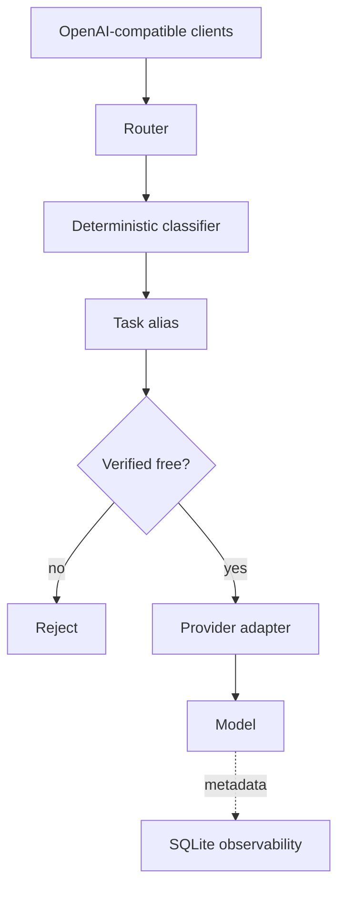

# Architecture

```mermaid
flowchart TD
  C[OpenAI-compatible clients] --> R[Router]
  R --> CL[Deterministic classifier]
  CL --> A[Task alias]
  A --> V{Verified free?}
  V -- no --> X[Reject]
  V -- yes --> P[Provider adapter]
  P --> M[Model]
  M -. metadata .-> O[SQLite observability]
```

Provider adapters implement discovery, free verification, health, chat/streaming, capabilities, and usage normalization. Telemetry is fail-open and contains no content.
