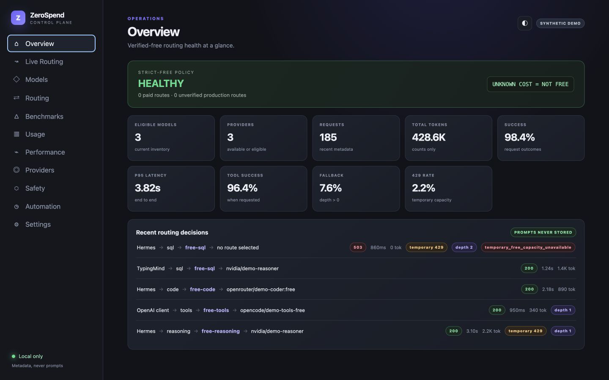
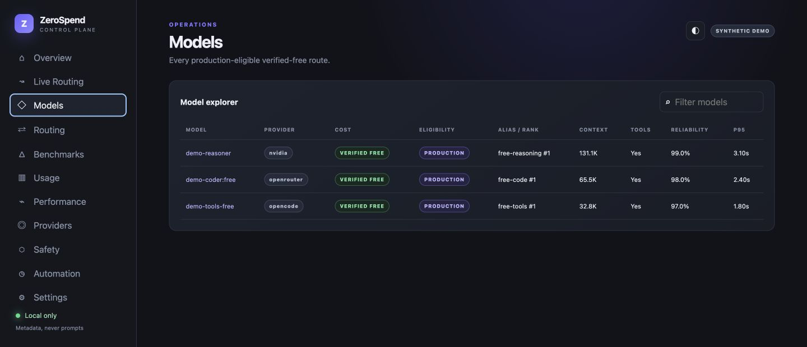
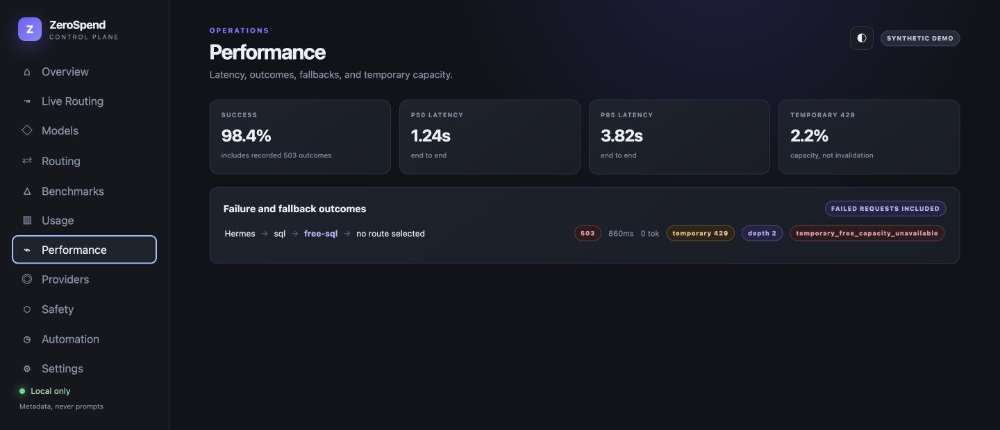

# ZeroSpend Console

The loopback console has eleven views: Overview, Live Routing, Models, Routing, Benchmarks, Usage, Performance, Providers, Safety, Automation, and Settings. They expose routing reasons, fallback and exhaustion states, provider/model health, benchmark history, aggregate tokens and latency, free-evidence decisions, schedule state, and local privacy settings.

It reads only ZeroSpend state files and the metadata event store. Prompt text, completions, SQL, tool arguments/results, credentials, and external telemetry are absent by design. `npm run demo` loads deterministic synthetic fixtures—including SQL, code, tools, a temporary 429 fallback, an exhausted-capacity 503 record, provider capacity, and a free-status rejection—and contacts no provider.

The screenshots below contain synthetic demo data only.

## Overview

The main Console view keeps strict-free health, aggregate metadata, and recent routing outcomes in one complete frame.

## Verified-free models

This view shows every current demo route with its provider, zero-cost evidence, production eligibility, alias rank, context, tool support, reliability, and latency.

## Routing outcome

The performance view captures one complete synthetic exhausted-capacity event: HTTP 503, temporary HTTP 429 state, fallback depth, and `temporary_free_capacity_unavailable`—without exposing prompt content.

