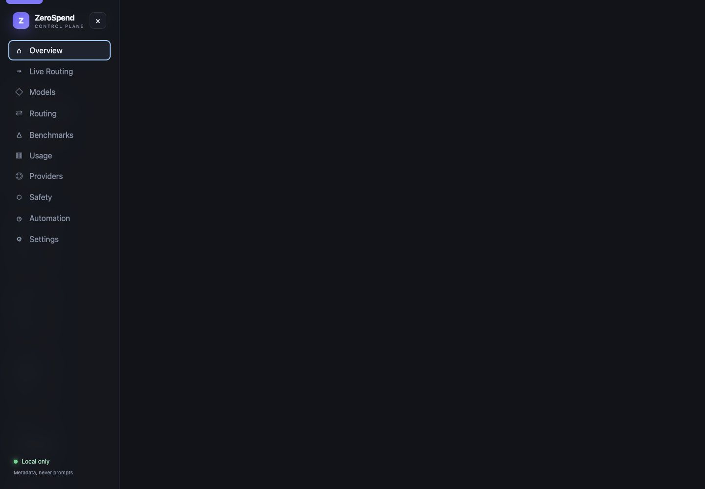
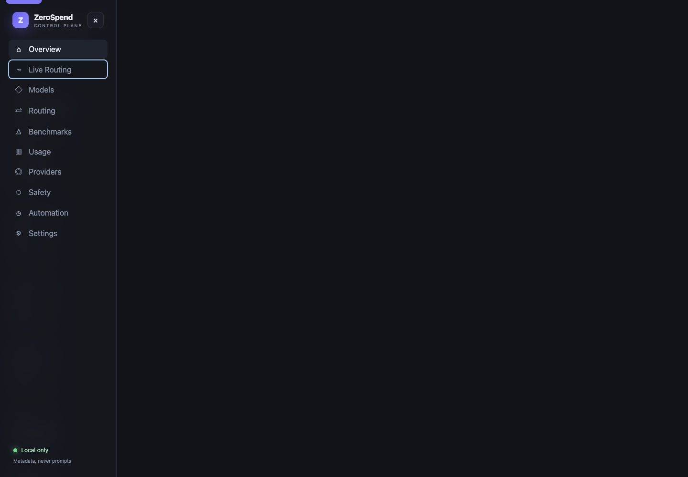
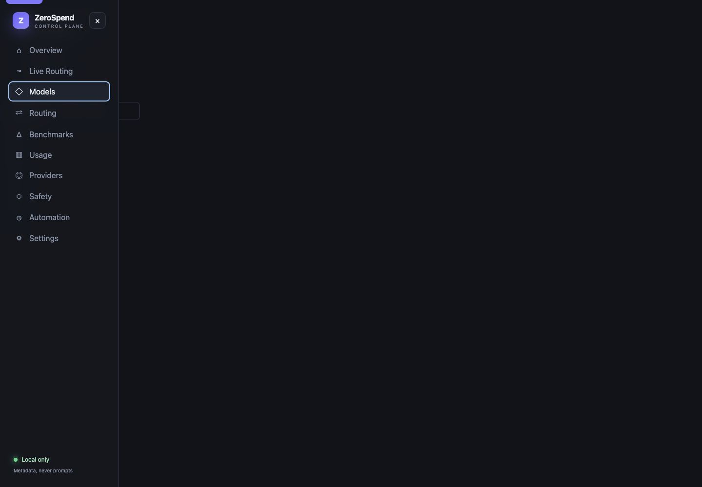
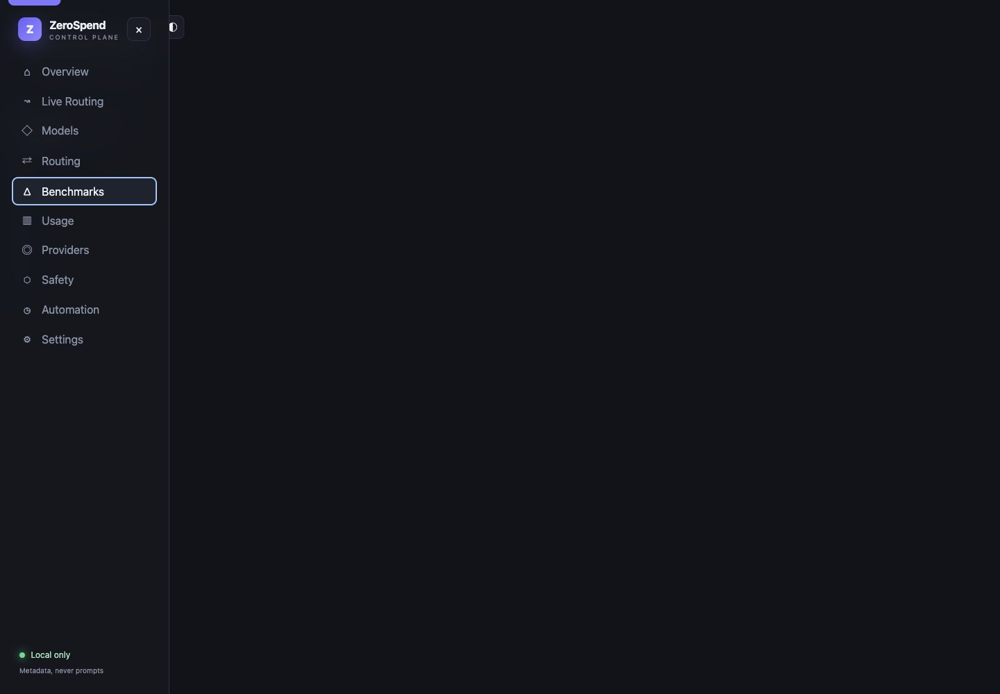
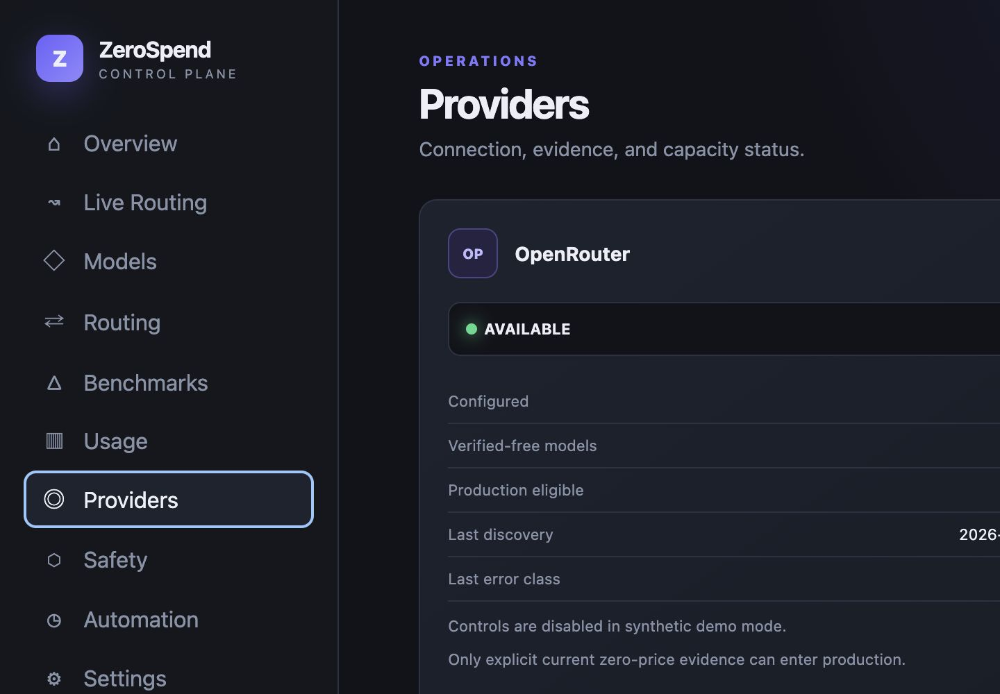
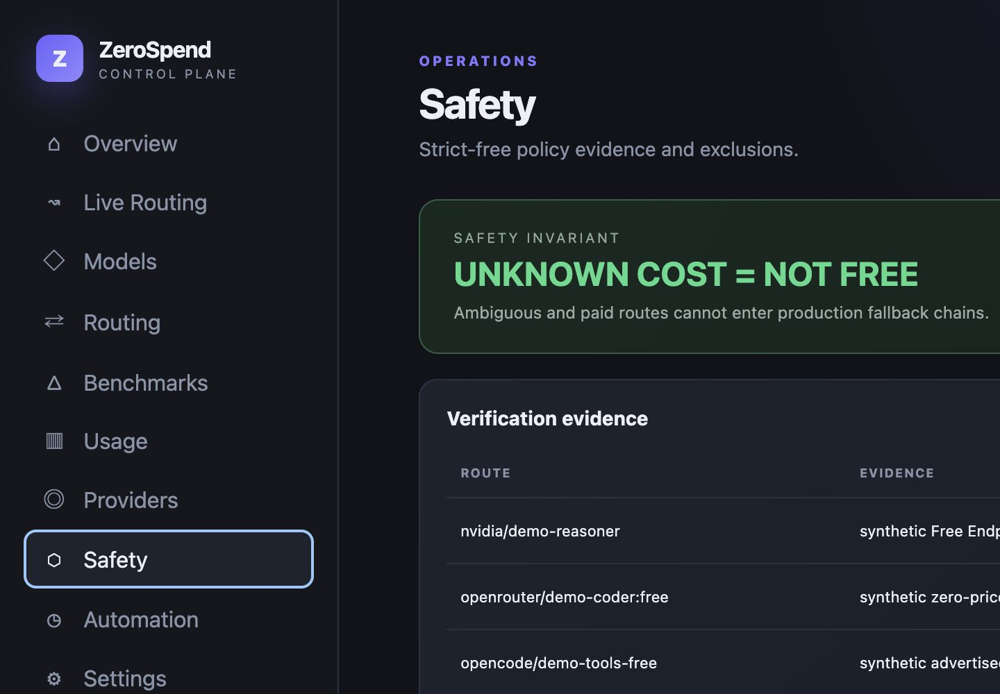
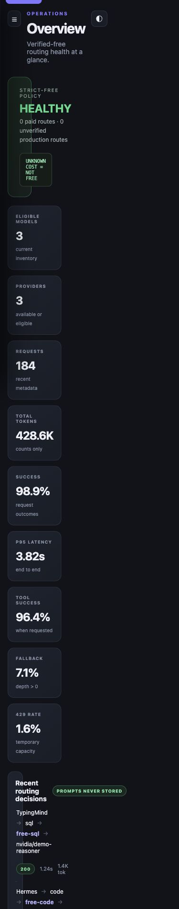

# ZeroSpend Console

The loopback console has ten views: Overview, Live Routing, Models, Routing, Benchmarks, Usage, Providers, Safety, Automation, and Settings. They expose routing reasons, fallback chains, provider/model health, benchmark history, aggregate tokens and latency, free-evidence decisions, schedule state, and local privacy settings.

It reads only ZeroSpend state files and the metadata event store. Prompt text, completions, SQL, tool arguments/results, credentials, and external telemetry are absent by design. `npm run demo` loads deterministic synthetic fixtures—including SQL, code, tools, a 429 fallback, provider capacity, and a free-status rejection—and contacts no provider.

The screenshots below contain synthetic demo data only.

## Overview and live routing

## Models and benchmarks

## Providers and safety

## Responsive layout

