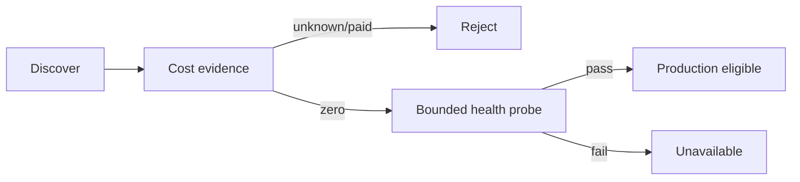

# Free verification

The invariant is `UNKNOWN COST = NOT FREE`. Eligibility needs current route-level zero-price evidence and current availability. Promotional credit is insufficient. A discovery failure preserves the last known-good production configuration rather than admitting uncertain routes.

