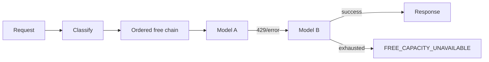

# Routing

Classification priority is tools, structured output, long context, SQL, code, reasoning, fast, then general. Alias order is stable unless a weekly benchmark clears the promotion margin or the current primary degrades.

